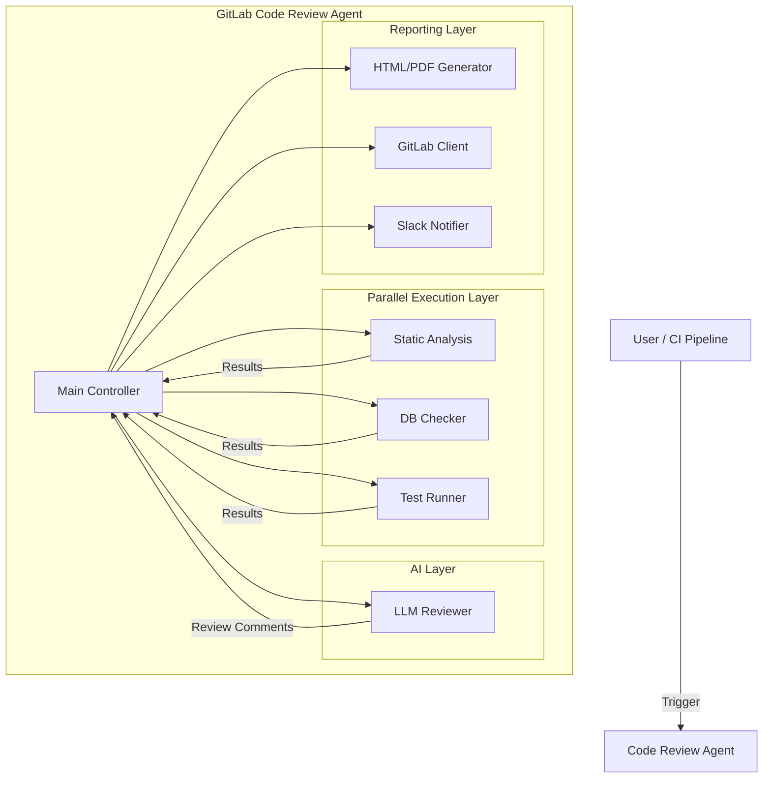

# System Architecture

## Overview
The **GitLab Code Review Agent** is a modular, containerized application designed to automate code reviews within a CI/CD pipeline. It integrates static analysis, security scanning, database checks, and AI-powered logic to provide comprehensive feedback on Merge Requests.

## High-Level Diagram

## Components

### 1. Core Controller (`src/main.py`)
-   **Responsibility**: Orchestrates the entire review process.
-   **Flow**:
    1.  Parses arguments and environment variables.
    2.  Fetches changed files from GitLab (or local FS).
    3.  Executes analysis tasks in parallel using `ThreadPoolExecutor`.
    4.  Aggregates results.
    5.  Triggers AI review.
    6.  Generates reports and sends notifications.

### 2. Analyzers (`src/analyzer.py`)
-   **Static Analysis**: Wraps tools like `pylint`, `eslint`, `checkstyle`.
-   **Security**: Integrates `detect-secrets` to find API keys and passwords.
-   **Compliance**: Checks for specific coding standards (e.g., Korea Public Sector guidelines).

### 3. Test Runner (`src/test_runner.py`)
-   **Polyglot Support**: Detects project type (Maven, NPM, Python).
-   **Execution**: Runs Unit, Integration, and E2E tests.
-   **Parsing**: Parses JUnit XML reports to provide detailed failure analysis.

### 4. LLM Reviewer (`src/llm_reviewer.py`)
-   **Providers**: Supports OpenAI, Claude, Gemini, and Ollama (Local).
-   **Context**: Sends code diffs to the LLM with specific prompts for code quality, security, and performance.

### 5. Reporting (`src/reporter.py`)
-   **HTML**: Uses Jinja2 templates to render rich reports.
-   **PDF**: Converts HTML to PDF using `xhtml2pdf` for archival.
-   **History**: Stores timestamped reports in `reports/history/`.
